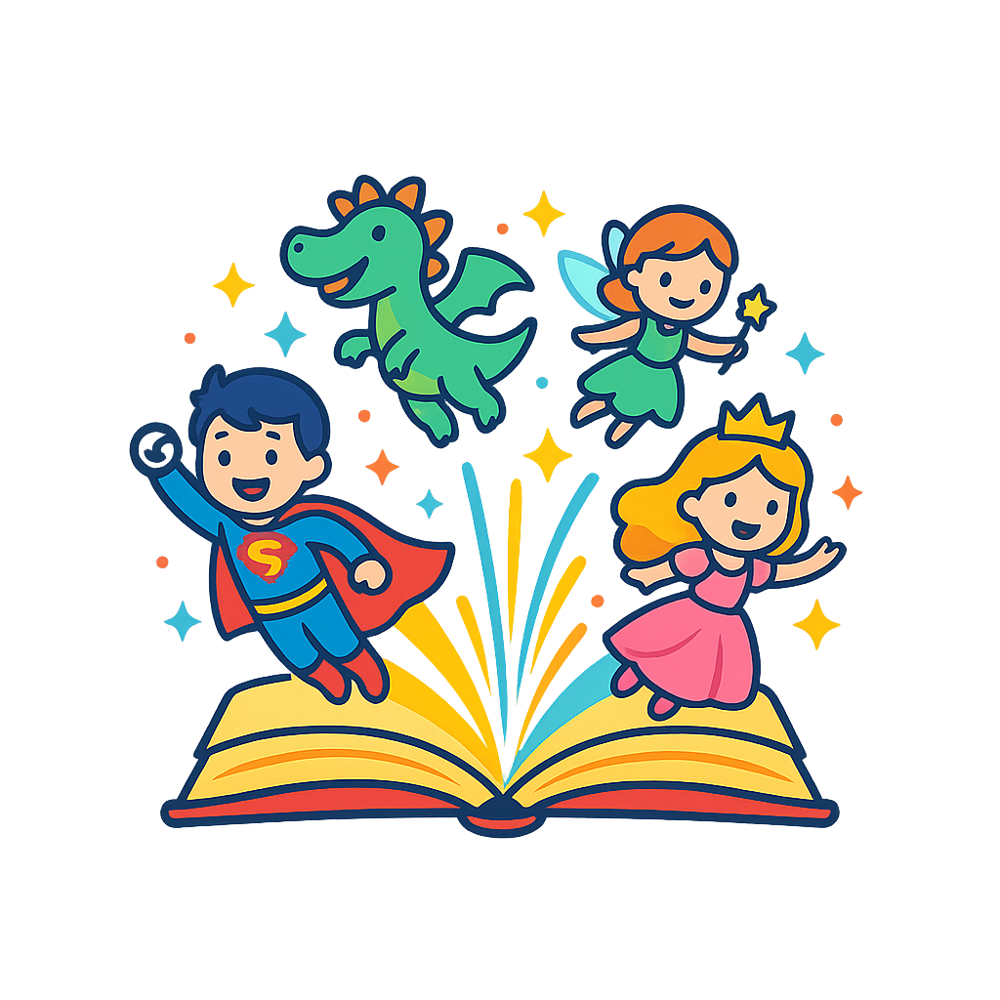

# 📖 Mundo de Histórias

Bem-vindo ao **Mundo de Histórias** ✨  
Um aplicativo divertido, pensado com carinho para crianças, onde a imaginação ganha vida através de contos, fábulas e aventuras ilustradas.  
A ideia nasceu de criar um espaço mágico onde as crianças possam **ler, explorar e sonhar** com histórias em um ambiente seguro e amigável.

---

## 🚀 Tecnologias Utilizadas  

  
  
  
  
  

---

## 🎯 A ideia  
Sempre gostei de histórias infantis e percebi que muitas vezes elas são apresentadas de maneira pouco interativa.  
O **Mundo de Histórias** veio como solução para isso:  
um aplicativo alegre, colorido e fácil de usar que coloca a criança no centro da experiência.  

- **Login divertido** com botões sociais e design lúdico  
- **Interface limpa** e adaptada para telas grandes como o Galaxy S20 Ultra  
- **Disponível para Android e iOS**, garantindo acesso a todos  
- **Planos premium** para acessar histórias exclusivas  
- **Criação de perfis** para que cada criança tenha seu próprio espaço personalizado  

---

## 🎨 Design  
O projeto busca sempre trazer uma aparência **leve, mágica e divertida**.  
O **login**, por exemplo, já transmite esse clima com cores suaves e a logo representando os personagens saltando de um livro aberto ✨.  

---

## 📌 Status do Projeto  

- [x] Estrutura inicial do projeto em Fluter  
- [x] Tela de Login desenvolvida e estilizada  
- [x] Integração da logo personalizada  
- [ ] Implementação do cadastro de usuário  
- [ ] Área Premium de Histórias  
- [ ] Publicação no **Google Play**  
- [ ] Publicação na **App Store**  

---

## 💡 Reflexão  
Esse projeto está sendo construído de forma **iterativa** — passo a passo, compondo telas, ajustando visual e conectando com a ideia central.  
É incrível ver o “Mundo de Histórias” saindo do papel e tomando forma.  

---

📖✨ *Aqui, cada linha de código é um pedacinho de imaginação ganhando vida!*